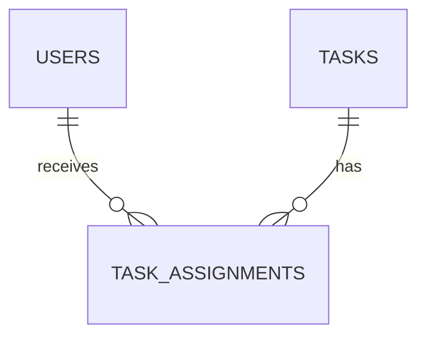

# Intelligent Workflow Management System

**C++ console application · MySQL · academic project**  
Built by [Esther Lee Qian Hui](https://github.com/assumie) during Workshop 1 (2025/2026).

> **Portfolio case study:** This repository currently documents the project. The original C++ source, SQL schema, and real application screenshots have not been recovered for publication yet. There is no runnable demo or setup command in this repository. I will add those after reviewing the original files.

## The problem

A task list becomes difficult to manage when assignments, priorities, due dates, and progress live in separate places. IWMS was designed as a small role-based workflow system so administrators could assign and review work and users could keep their own tasks up to date.

## What I built

| Area | Project behavior |
| --- | --- |
| User access | Admin and user login with separate menus. |
| Admin workflow | Manage users, create tasks, assign tasks, view all tasks, and generate reports. |
| User workflow | View assigned tasks and details, update a task's status, and check reminders. |
| Task tracking | Status, priority, due date, and overdue reminders. |
| Reporting | Counts, tasks grouped by status, average tasks per user, assigned-task joins, and a query for users with above-average task counts. |

The project uses **C++ in Visual Studio 2022** with **MySQL Connector/C++** and a MySQL database named `iwms_db`. It is a command-line project; the console interface uses quick choices for due date, status, and priority to make everyday updates faster.

## How the system fits together

The relationship above is a **conceptual summary**, not a copy of the original SQL definition. The project used `users`, `tasks`, and `task_assignments` tables. The exact columns, keys, and constraints will be documented after the original schema is available. See [data-model notes](docs/data-model.md).

## My approach

1. Separate admin actions from the user's task menu.
2. Keep task updates short with quick choices for status (`p` / `i` / `c`) and priority (`l` / `m` / `h`).
3. Surface overdue work and task details where users can act on them.
4. Use SQL aggregation, joins, and a subquery to turn task records into useful admin reports.

## What I learned

This project gave me practice connecting a C++ program to a relational database, modeling task assignments, and turning raw records into reports. It also made me think about how much menu wording and input shortcuts affect a command-line tool's usability.

## Project status

- **Available now:** project scope, workflows, and a conceptual data model.
- **To publish from the original project:** reviewed C++ source, SQL schema, genuine screenshots, and verified Windows setup steps.
- **Privacy:** sample credentials or real user/task records will be removed before any source or screenshots are published.

### 中文简介

IWMS 是我在 Workshop 1 制作的 **C++＋MySQL 工作流程管理系统**。管理员可以管理用户、建立及分配任务、查看进度和报表；一般用户可以查看自己的任务并更新状态。目前仓库先展示项目设计与功能，原始源码和真实截图整理好后才会公开，不会把重新制作的画面当作当年的成品。
