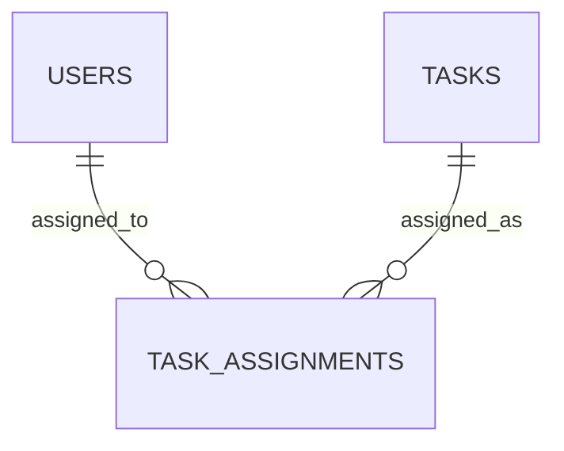

# IWMS data model notes

This is a **conceptual** description reconstructed from project notes. It does not claim to reproduce the original SQL schema.

| Table | Known purpose | Relationship |
| --- | --- | --- |
| `users` | Stores system users and their roles. | A user can have task assignments. |
| `tasks` | Stores tasks, including the details needed for tracking and reports. | A task can have assignments. |
| `task_assignments` | Connects users with assigned tasks. | References a user and a task. |

## Reporting questions supported by the project

- How many tasks are there, and how many are in each status?
- How many tasks are assigned to each user?
- Which tasks belong to which users?
- Which users have more tasks than the average assignment count?

**Pending original evidence:** exact field names, primary and foreign keys, constraints, SQL queries, and screenshots of report output. They will be added only after checking the original project files.
